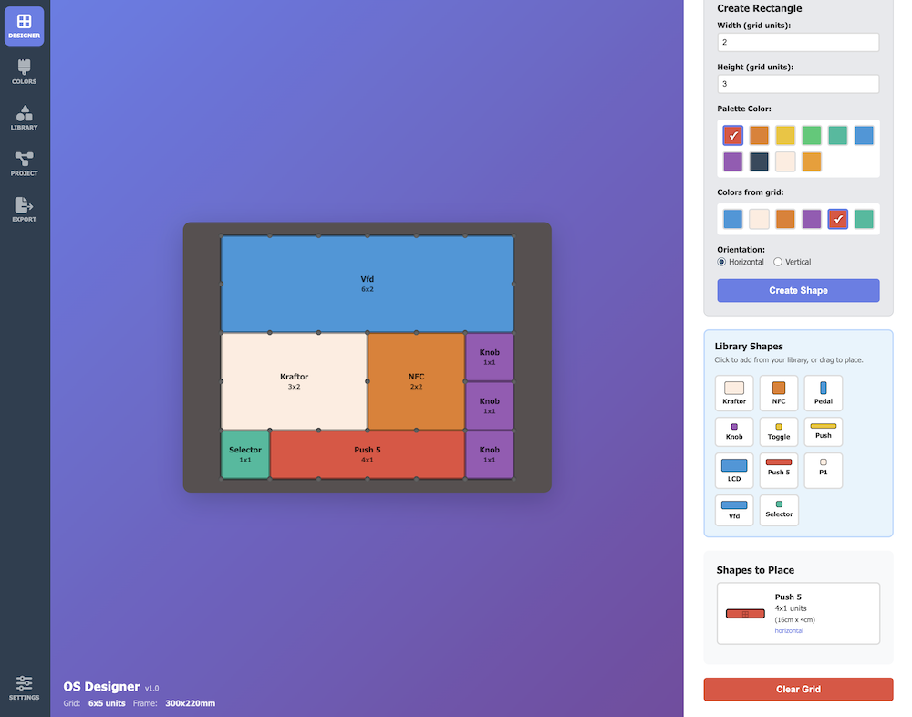

# OS Designer

A visual grid layout tool for designing OpenStructures-compatible panels and frames. Create, arrange, and export modular component layouts with precision.



## Features

- **Visual Grid Editor** - Drag and drop shapes onto a customizable grid
- **Shape Library** - Create reusable named components (buttons, knobs, displays, etc.)
- **Multiple Export Formats** - SVG for laser cutting, STL for 3D printing
- **Project Save/Load** - Save your work and share with others
- **Real-time Dimensions** - Always see grid and frame sizes in mm/cm

## Getting Started

1. Open `OS_Designer.html` in a modern web browser (Chrome, Firefox, Edge)
2. The app runs entirely in your browser - no installation needed

## Interface Overview

### Left Menu

| Icon    | Panel        | Description                                     |
| ------- | ------------ | ----------------------------------------------- |
| Grid    | **Designer** | Main workspace for placing shapes               |
| Brush   | **Colors**   | Customize the 10-color palette                  |
| Shapes  | **Library**  | Create and manage reusable named shapes         |
| Project | **Project**  | Save/load project files                         |
| Export  | **Export**   | Download SVG or STL files                       |
| Sliders | **Settings** | Configure grid size, frame borders, screw holes |

### Bottom-Left Info

Displays current grid size and total frame dimensions in real-time.

## How to Use

### Basic Workflow

1. **Set up your grid** (Settings panel)
   - Choose grid size (e.g., 5x5 units)
   - Set outer frame border width
   - Configure screw hole diameter

2. **Create shapes** (Designer panel)
   - Enter width and height in grid units
   - Select a color
   - Click "Create Shape"
   - Drag the shape from the sidebar onto the grid

3. **Use Library shapes** (recommended)
   - Go to Library panel
   - Create named shapes (e.g., "Knob", "LCD", "Button")
   - In Designer panel, click library shapes to add them
   - Or drag them directly onto the grid

4. **Export your design**
   - SVG for laser cutting (2D outline with screw holes)
   - STL for 3D printing (with configurable thickness)

### Grid Units

- Each grid unit = **4cm × 4cm** (40mm)
- Screw holes are placed at grid intersections
- Shapes snap to grid positions

## Panels in Detail

### Designer Panel

- **Create Rectangle** - Make one-off shapes with specific dimensions
- **Library Shapes** - Quick access to your saved library components
- **Shapes to Place** - Queue of shapes ready to be placed on the grid
- **Clear Grid** - Remove all placed shapes (returns them to the queue)

**Tips:**
- Drag shapes to reposition them on the grid
- Right-click or use the × button to delete a placed shape
- Shapes from the library can be placed multiple times

### Library Panel

Create reusable named components:

1. Enter a **name** (e.g., "Rotary Encoder")
2. Set **width** and **height** in grid units
3. Choose a **color**
4. Click **Add to Library**

**Share Library:**
- **Export** - Save your library as a JSON file to share
- **Import** - Load a shared library file (merges with existing)

### Colors Panel

Customize the 10-color palette used for shapes. Click "Save Colors" to persist changes.

### Project Panel

- **Save Project** - Downloads a JSON file with all settings, shapes, and library
- **Load Project** - Restore a previously saved project
- **Project Info** - Shows current grid and frame dimensions

### Export Panel

**SVG Export (for CNC/Laser)**
- 2D vector file with accurate dimensions in mm
- Includes outer frame, inner cutout, and screw hole arcs
- Ready for laser cutting or CNC routing

**STL Export (for 3D Printing)**
- Set panel thickness (default 3mm)
- Option to fill center (solid panel vs frame)
- Preview in 3D before downloading
- Watertight mesh ready for slicing

### Settings Panel

- **Grid Size** - Width × Height in units (1-16)
- **Screw Diameter** - Size of mounting holes (default 4mm)
- **Outer Frame Width** - Border around the grid (left/right, top/bottom)
- **Frame Color** - Visual color of the frame border

## Keyboard & Mouse

| Action                  | Result        |
| ----------------------- | ------------- |
| Drag shape from sidebar | Place on grid |
| Drag shape on grid      | Reposition    |
| Right-click shape       | Delete        |
| Click × button          | Delete shape  |

## File Formats

### Project File (`.json`)
Contains everything: grid settings, colors, library shapes, placed shapes.

```json
{
  "version": "1.1",
  "settings": { "gridSizeX": 5, "gridSizeY": 5, ... },
  "colors": ["#e74c3c", ...],
  "libraryShapes": [{ "name": "Knob", "width": 1, ... }],
  "placedShapes": [{ "x": 0, "y": 0, "shape": {...} }]
}
```

### Library File (`.json`)
Just the library shapes, for sharing components:

```json
{
  "version": "1.0",
  "type": "os-designer-library",
  "shapes": [{ "name": "Knob", "width": 1, "height": 1, ... }]
}
```

## Sample Library

A `sample-library.json` file is included with common components:
- Knob, Button, LED, Switch, Slider
- LCD 2x2, LCD 4x2
- NFC, Kraftor
- Push 4, Push 5

Import it from the Library panel to get started quickly.

## Browser Compatibility

- **Chrome/Edge** - Full support (including Save As dialogs)
- **Firefox** - Full support (downloads go to default location)
- **Safari** - Full support

## Data Storage

- **Library shapes** - Saved in browser localStorage (persistent)
- **Color palette** - Saved in browser localStorage
- **Grid settings** - Saved in browser localStorage
- **Projects** - Saved as downloaded JSON files

**Note:** localStorage is browser-specific. Use Project files to transfer designs between browsers or computers.

## OpenStructures Compatibility

This tool is designed for the [OpenStructures](http://openstructures.net/) grid system:
- 4cm × 4cm base unit
- M4 screw holes at intersections
- Modular, compatible dimensions

## License

MIT License - Free to use, modify, and distribute.

---


